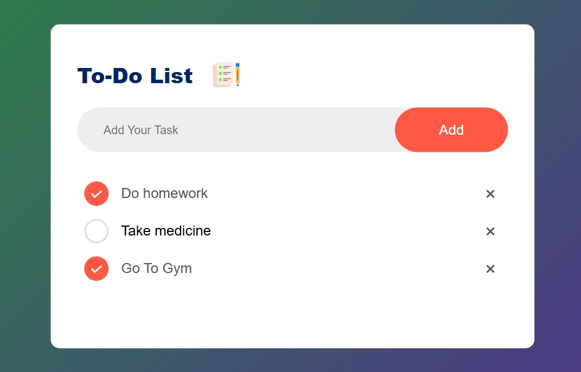

#  TO-DO list App

Its a todo list app developed just using html,css and javascript with a beautiful UI.

  

##  Table of Contents

-  [Technologies-Used](#technologies-used)

-  [Installation](#installation)

-  [License](#license)

  

##  Technologies-Used

  

- HTML

- CSS
  
- JAVASCRIPT 

  
##  Page Live
[Click](https://roshan-metrix.github.io/To-Do-List-App/)

  

##  Installation

  

Step-by-step instructions to set up the project locally:
1. Clone the repository:

        git clone https://github.com/Roshan-Metrix/To-Do-List-App.git

  
2. Navigate to the project directory:

       cd To-Do-List-App

3. Install dependencies

       npm install  

4. Run App

       npm start dev

  
## License

This project is licensed under the [MIT License](license.txt).

## Screenshot

  

